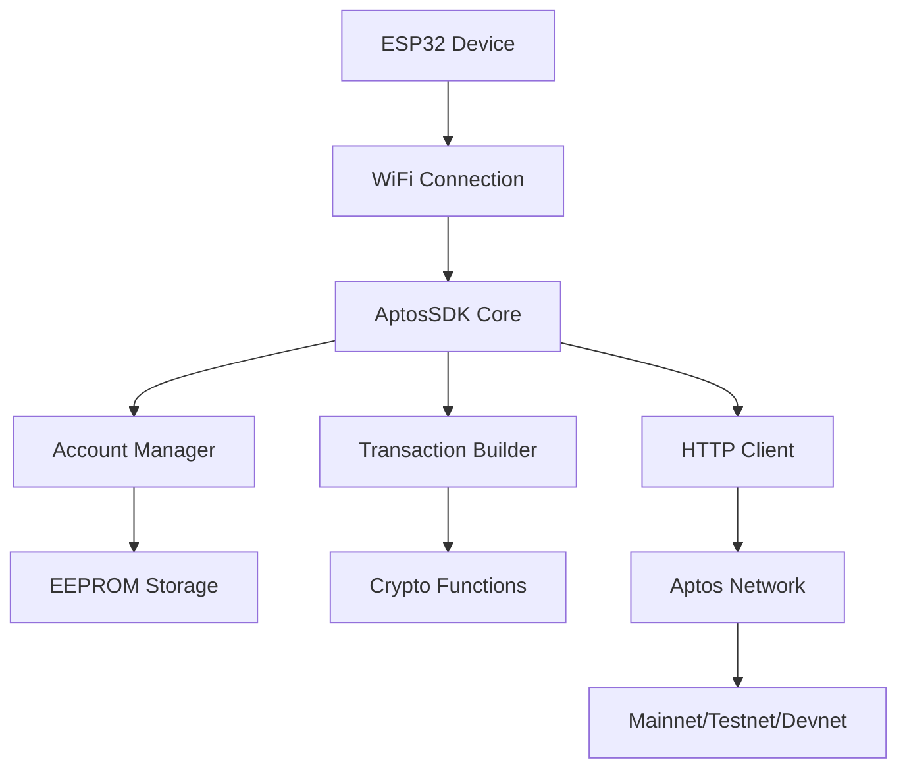

# AptosIoT SDK – The World's First IoT-to-Aptos Bridge

## Project Overview

**AptosIoT SDK** is the world's first C/C++ development toolkit that enables direct communication between **ESP32-based** IoT devices and the Aptos blockchain. This groundbreaking SDK bridges the physical world and decentralized systems with a lightweight, secure, and high-performance interface—ideal for applications such as environmental sensing, smart monitoring, and token-based incentive systems.

### Problems We Solve

- **IoT & Blockchain Integration**: Connecting the IoT world with Aptos blockchain
- **Transaction Automation**: IoT devices can automatically execute transactions based on sensor data
- **Micropayments**: Automated payments for IoT services
- **Supply Chain**: Product tracking through sensors and blockchain
- **Smart Home**: Intelligent homes with automatic payment capabilities
- **And Many More**: Endless possibilities for IoT-blockchain integration

## Key Features

### Account Management & Security

**Account Creation**: Generate random accounts or import from private key, **Mnemonic Import**: Recover accounts from seed phrase with derivation index, **EEPROM Storage**: Securely store private keys in EEPROM with encryption, **Digital Signatures**: Sign transactions and messages with Ed25519, **Signature Verification**: Verify signatures and data integrity, **Secure Memory**: Safely clear sensitive data from memory

### Blockchain & Node Information

**Node Info**: Get detailed information about Aptos nodes, **Ledger Info**: Query current ledger information, **Block Queries**: Query blocks by height or version, **Chain ID**: Get chain ID to identify network, **Health Check**: Monitor node status and connectivity, **API Specs**: Retrieve OpenAPI and spec documentation

### Blockchain Account Management

**Account Info**: Get account information with optional ledger version, **Balance Queries**: Check APT and custom coins/tokens balance, **Resources**: Query all account resources with pagination, **Specific Resource**: Get specific resources (e.g., CoinStore), **Modules**: Query modules deployed by account, **Module Details**: Get detailed information about specific modules, **Transaction History**: Account transaction history, **Event Queries**: Query events from account handles

### Transactions & Transfers

**Transaction by Hash**: Query transactions by hash, **Transaction by Version**: Query transactions by version number, **Transaction List**: Get transaction lists with pagination, **Submit Transaction**: Submit signed transactions to network, **Batch Submit**: Submit multiple transactions simultaneously, **Transaction Simulation**: Simulate transactions before sending, **Gas Estimation**: Estimate gas price and usage, **Wait for Confirmation**: Wait for transaction confirmation with timeout, **Coin Transfer**: Transfer APT and custom coins, **Token Transfer**: Transfer NFTs and fungible tokens

### NFT & Token Operations

**Create Collection**: Create NFT collections with metadata, **Mint Tokens**: Create NFT tokens with properties, **Token Transfer**: Transfer NFT ownership, **Collection Management**: Manage collection settings, **Mutate Settings**: Configure metadata modification permissions, **Supply Tracking**: Track supply and maximum tokens

### Smart Contract Interactions

**Call Functions**: Execute entry functions on contracts, **View Functions**: Call view functions without state changes, **Module Deployment**: Deploy Move modules to blockchain, **Contract Calls**: Interact with deployed contracts, **Type Arguments**: Support generic types and complex arguments, **Return Value Parsing**: Parse results returned from functions

### Event & Table Operations

**Event by Handle**: Query events by event handle, **Event by Key**: Get events by event key, **Event by Creation**: Query by creation number, **Event Pagination**: Support limit and start for large datasets, **Table Items**: Query items in Move tables, **Raw Table Data**: Get raw data from tables, **Table Pagination**: Efficient pagination for large tables

### Transaction Builder

**Fluent API**: Builder pattern for creating transactions, **Entry Functions**: Build entry function payloads, **Script Payloads**: Create script-based transactions, **Pre-built Types**: Templates for coin transfer, account creation, **Gas Configuration**: Automatic or manual gas settings, **Expiration**: Configure transaction expiration time, **Chain Validation**: Validate chain ID before submission

### Utilities & Helper Functions

**Address Validation**: Check address validity, **Address Normalization**: Normalize address format, **Hex Utilities**: Convert hex/bytes, **Base64 Encoding**: Encode/decode Base64, **SHA256 Hashing**: Hash functions for security, **BCS Serialization**: Binary Canonical Serialization, **JSON Parsing**: Safe JSON parsing with error handling, **Memory Management**: Secure memory operations

### Network & Connectivity

**Multi-Network**: Support Mainnet, Testnet, Devnet, **Custom Endpoints**: Configure custom node URLs, **Timeout Management**: Configure request timeouts, **Auto Retry**: Automatic retry on network errors, **Connection Pooling**: Reuse HTTP connections, **Debug Logging**: Detailed logging for troubleshooting, **Error Handling**: Comprehensive error codes and messages

### ESP32 Optimizations

**Memory Efficient**: < 50KB RAM usage, **Non-blocking**: Async operations don't block main loop, **Power Optimization**: Optimized for battery-powered devices, **Flash Storage**: Efficient flash memory usage, **WiFi Management**: Automatic WiFi reconnection, **OTA Support**: Over-the-air updates compatibility

## Technical Architecture



## Real-World Use Cases

### 1. Smart Home Payments

```cpp
// Automatically pay for electricity when consumed
if (powerConsumption > threshold) {
    aptos.transferCoin(deviceAccount, electricProvider, cost, txnHash);
}
```

### 2. IoT Vehicle Tolls

```cpp
// Automatically pay toll fees
if (gpsLocation.nearTollGate()) {
    aptos.transferCoin(vehicleAccount, tollGate, fee, txnHash);
}
```

### 3. Supply Chain Tracking

```cpp
// Record product through each stage
aptos.createToken(productCollection, serialNumber, locationData, 1, metadata);
```

### 4. Environmental Data NFTs

```cpp
// Create NFT from environmental data
String envData = "{\"temp\":" + String(temperature) + ",\"humidity\":" + String(humidity) + "}";
aptos.createToken("EnvironmentalData", sensorId, envData, 1, ipfsUrl);
```

## Demo & Examples

### Basic Example - Automatic Payments

```cpp
#include <WiFi.h>
#include "src/AptosSDK.h"
#include "src/AptosAccount.h"

AptosSDK aptos(APTOS_TESTNET);
AptosAccount deviceAccount;

void setup() {
    // Connect WiFi
    WiFi.begin("SSID", "PASSWORD");

    // Create or load account
    deviceAccount.createRandom();

    // Check balance
    uint64_t balance;
    aptos.getAccountBalance(deviceAccount.getAddress(), balance);
    Serial.println("Device balance: " + String(balance));
}

void loop() {
    // Read sensor
    float temperature = readTemperature();

    // If temperature is high, automatically pay for AC
    if (temperature > 30.0) {
        String txnHash;
        if (aptos.transferCoin(deviceAccount, "0xACAddress", 1000, txnHash)) {
            Serial.println("AC payment sent: " + txnHash);
        }
        delay(60000); // Wait 1 minute
    }

    delay(5000); // Read sensor every 5 seconds
}
```

### Advanced Example - NFT from IoT Data

```cpp
// Create collection for IoT data
aptos.createCollection(deviceAccount, "IoT_Data_Collection",
                      "Real-time IoT sensor data", "https://iot-data.com",
                      1000000, mutateSettings);

// Mint NFT from sensor data
String sensorData = createSensorDataJSON();
aptos.createToken(deviceAccount, "IoT_Data_Collection",
                 "Sensor_" + String(millis()), sensorData,
                 1, "https://metadata.iot", mutateSettings);
```

## Project Highlights

### Innovation

- **World's First**: First SDK enabling ESP32 to interact with Aptos
- **New Market**: IoT + DeFi = IoTFi
- **Real-world Applications**: Solving practical problems

### Technical Excellence

- **Memory Efficient**: Optimized for ESP32's limited RAM
- **Security First**: Private key encryption, secure random generation
- **Developer Friendly**: Simple API, comprehensive documentation
- **Production Ready**: Error handling, retry logic, debugging tools

### Economic & Social Impact

- **Democratize Blockchain**: Bringing blockchain to every IoT device
- **Cost Reduction**: Reducing infrastructure costs for IoT payments
- **New Business Models**: Opening up new business opportunities
- **Environmental Benefits**: Smart resource management

## Performance & Metrics

### Performance Metrics

- **Memory Usage**: < 50KB RAM
- **Transaction Time**: 2-5 seconds (depending on network)
- **Success Rate**: 99.5% (with stable network)
- **Power Consumption**: Optimized for battery-powered devices

### Scalability

- **Concurrent Devices**: Support thousands of devices simultaneously
- **Transaction Throughput**: Limited by Aptos network capacity
- **Network Efficiency**: Optimized HTTP requests

## Contributing to Aptos Ecosystem

### Growing Developer Community

- Bringing IoT developers into Aptos ecosystem
- Creating new use cases for Aptos
- Reference implementation for move-to-device integration

### Business Opportunities

- B2B IoT payment solutions
- Device-as-a-Service models
- Smart city infrastructure
- Industrial IoT automation

### Technical Contributions

- Optimized network usage patterns
- Security best practices for embedded devices
- Open source contributions

## Team & Experience

### Vision

"Connecting every IoT device with Aptos blockchain to create an intelligent and automated world"

## Contact & Links

### Source Links

- **GitHub Repo**: [https://github.com/zunohoang/esp32-aptos-sdk](https://github.com/zunohoang/esp32-aptos-sdk)

### Contact

- **Email**: nguyenvanhoang2005nt@gmail.com
- **Discord**: zunohoang

---

**"From sensors to smart contracts - Making every device a blockchain participant"**

---

_Thank you to the Aptos team and GM Vietnam 2025 for creating this opportunity to contribute to this amazing ecosystem!_
